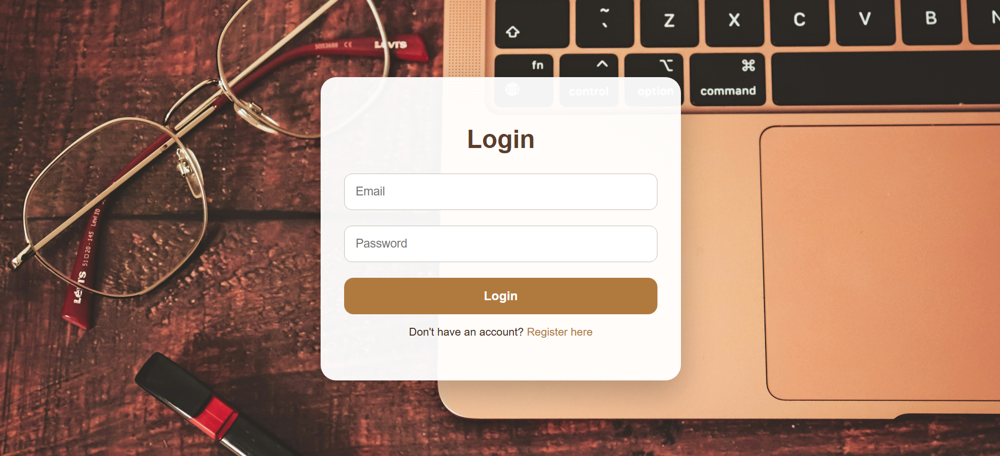
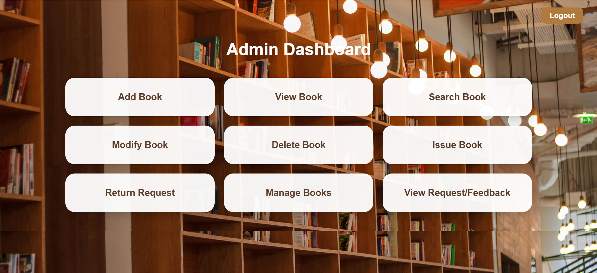
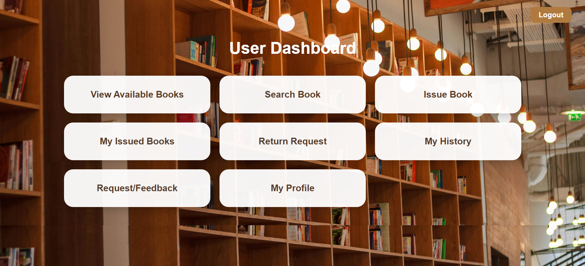
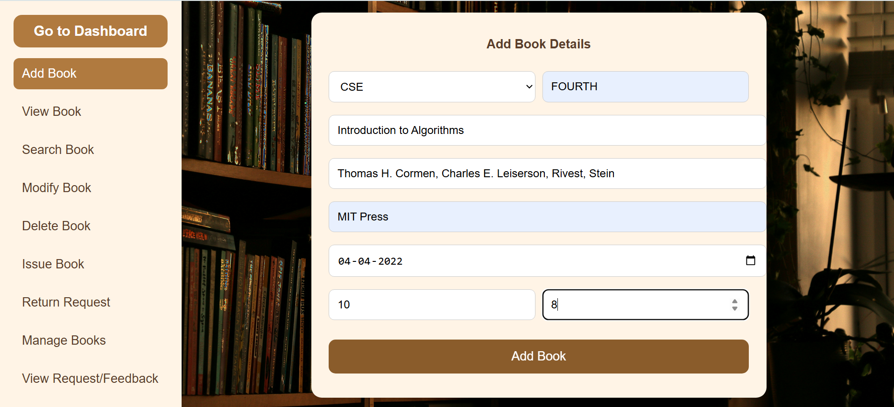
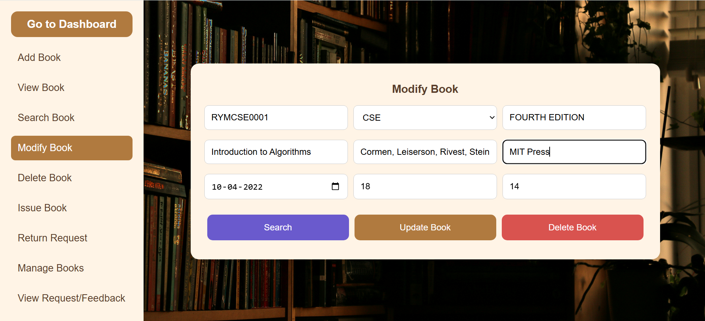
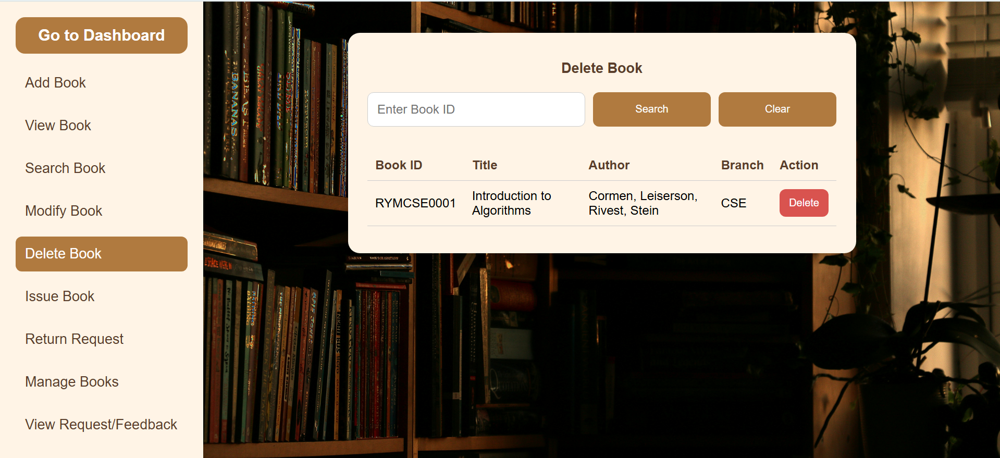
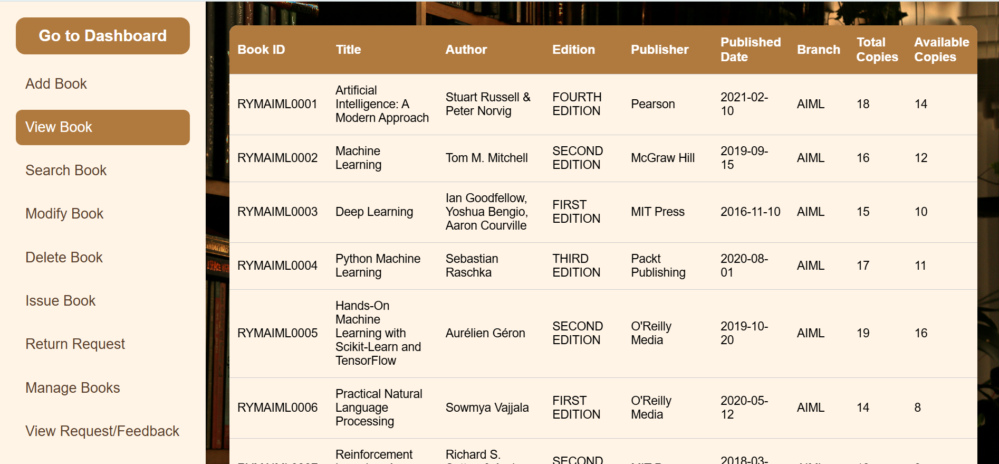
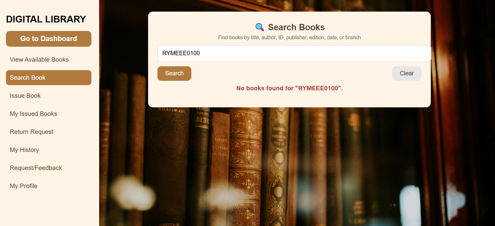

# 📚 Digital Library Management System (DLMS)

## 🔹 Overview

The Digital Library Management System (DLMS) is a web-based application designed to automate and streamline library operations such as book management, issuing, returning, and user tracking.

This system replaces traditional manual processes with a fast, secure, and user-friendly digital solution.

---

## 🔹 Features

### 👤 User Features

* User Registration & Login
* Search Books
* Request Book Issue
* Submit Return Requests
* View Issued Books & History
* Submit Feedback

### 🔑 Admin Features

* Add / Update / Delete Books
* Manage Library Inventory
* Approve / Reject Return Requests
* View User Activity
* Dashboard Overview

---

## 🔹 Technologies Used

* **Frontend:** HTML, CSS, Bootstrap
* **Backend:** PHP
* **Database:** MySQL
* **Server:** XAMPP (Apache)

---

## 🔹 System Architecture

* Three-Tier Architecture:

  * Presentation Layer (UI)
  * Application Layer (PHP)
  * Database Layer (MySQL)

---

## 🔹 Database

The system uses the following tables:

* users
* books
* transactions
* return_requests
* feedback

---

## 🔹 How to Run the Project

1. Install XAMPP
2. Start Apache and MySQL
3. Copy project folder into `htdocs`
4. Import the database file (`database.sql`) into phpMyAdmin
5. Open browser and run:
   http://localhost/dlib

---

## 🔹 Future Enhancements

* Fine calculation for overdue books
* Email/SMS notifications
* Book reservation system
* Analytics dashboard

---

## 🔹 Screenshots

### 🏠 Homepage

The homepage provides the entry point to the system with navigation options for login and registration.

### 🔐 Login Page

The login page allows users to enter credentials and access the system based on their role.

### 🛠 Admin Dashboard

The admin dashboard provides centralized control for managing books, users, and system activities.

### 👤 User Dashboard

The user dashboard allows users to search books, request issues, view history, and manage their account.

### ➕ Add Book (Admin Module)

This page allows the administrator to add new books with complete details into the system.

### ✏️ Modify Book (Admin Module)

The modify book page enables the admin to update existing book details in the database.

### ❌ Delete Book (Admin Module)

This interface allows the admin to remove book records from the system.

### 📖 View Books (Admin Module)

Displays the list of all books available in the system along with their details and availability.

### 🔍 Search Book (User Module)

Allows users to search for books and check availability in real time.

